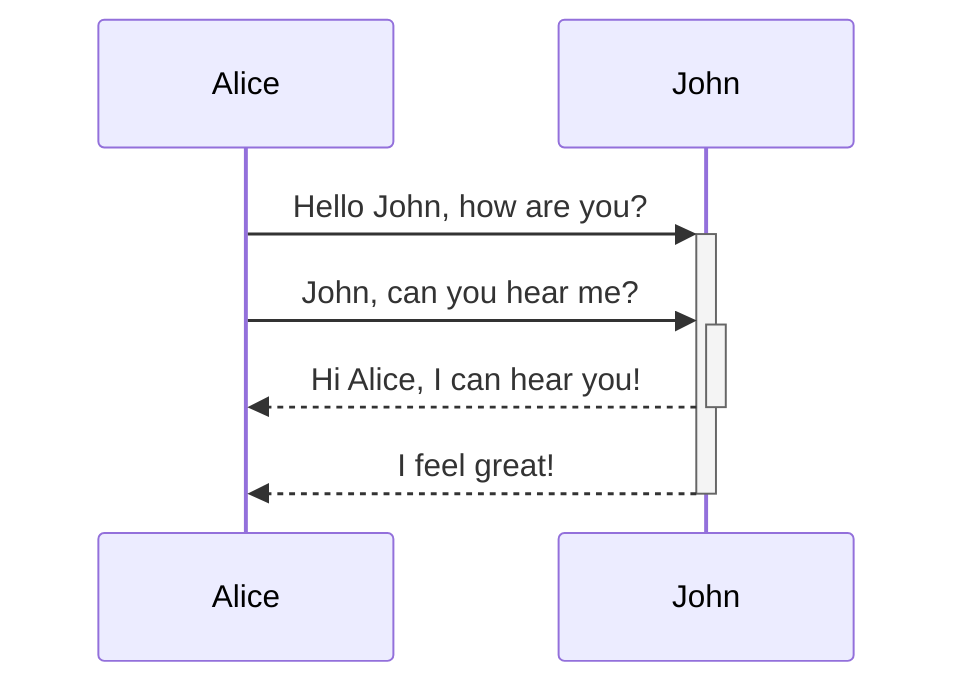

## A note to self

When designing a deep learning architecture, the statistical properties of the propagating is an important consideration to take note of. 

%%
It can span
multiple lines
%%

Here's a simple footnote,[^1] and here's a longer one. ^[notice that the carat goes outside of the brackets on this one.]

[^1]: meaningful!

Use two equal signs to ==highlight text==.

Any word wrapped with two tildes (like ~~this~~) will appear crossed out.

| Tables can be justified with a colon | Another example with a long title |
| :----------------------------------- | --------------------------------: |
| because of the `:`                   |           these will be justified |

If you put links in tables, they will work, but if you use Piped Links, the pipe must be escaped with a `\` to prevent it being read as a table element.

- [x] #tags, **formatting** supported
- [x] list syntax required (any unordered or ordered list supported)
- [x] this is a complete item
- [?] this is also a complete item (works with every character)
- [ ] this is an incomplete item
- [ ] tasks can be clicked in Preview to be checked off